# アーキテクチャ

このリポジトリの全体アーキテクチャと設計について説明します。

## 設計原則

**「Windows と Linux で同じ開発環境を構築する」** を目標に、以下の原則で管理する。

1. **Nix (Home Manager) がパッケージの Single Source of Truth (SSOT)**
   - 全 CLI ツールは `nix/packages/sets.nix` に一元定義
   - Linux/macOS: Home Manager が `home.packages` としてインストール
   - Windows: `nix build .#winget-export` で winget/npm/pnpm の JSON を導出
2. **chezmoi が設定ファイルの SSOT**
   - 全 OS 共通の dotfiles をテンプレートで管理
   - OS 固有の差分は `.chezmoiignore.tmpl` とテンプレート分岐で吸収
3. **OS 固有の処理は最小限に分離**
   - NixOS モジュール: システムレベル設定 (nix gc, Docker, WSL 固有)
   - PowerShell ハンドラー: Windows セットアップ自動化

## 全体構造

```
dotfiles/
├── nix/                    # NixOS/Home Manager configuration
│   ├── packages/
│   │   ├── sets.nix        # ★ SSOT: catalog (全パッケージ + winget + category)
│   │   └── winget.nix      # winget/npm/pnpm JSON 生成 derivation
│   ├── home/               # Home Manager 設定
│   │   ├── packages.nix    # sets.nix → home.packages
│   │   └── wsl/users.nix   # WSL ユーザー HM 設定
│   ├── flakes/             # Flake inputs/outputs, treefmt
│   ├── hosts/              # Host-specific configs (WSL, Linux)
│   ├── modules/            # Custom NixOS modules (system-level)
│   └── lib/                # Helper functions
├── chezmoi/                # User dotfiles (shell/git/terminal/VS Code/LLM)
├── scripts/                # All scripts
│   ├── sh/                 # Shell scripts (Linux/WSL)
│   └── powershell/         # PowerShell scripts (Windows)
├── windows/                # Windows-side config files (generated + static)
│   ├── winget/             # packages.json (generated from nix)
│   ├── pnpm/               # packages.json (generated from nix)
│   └── .wslconfig          # WSL configuration
├── docs/                   # Documentation
├── Taskfile.yml            # Task runner (WSL 経由で nix fmt 等を実行)
├── install.ps1             # NixOS WSL installer (auto-elevates to admin)
├── flake.nix               # Nix flake entry point
└── flake.lock
```

## セットアップフロー

```
Windows                              WSL (NixOS)
────────                             ───────────
install.ps1
    │
    ├─► Download NixOS WSL
    │
    ├─► Import to WSL
    │
    └─► scripts/sh/nixos-wsl-postinstall.sh ──► ~/.dotfiles (symlink)
                                                  │
                                                  ▼
                                             nixos-rebuild switch
                                                  │
                                                  ▼
                                             NixOS configured
```

## 役割分担

| 役割                  | ツール          | 説明                                         |
| --------------------- | --------------- | -------------------------------------------- |
| パッケージ定義 (SSOT) | Nix             | `nix/packages/sets.nix` に全ツールを一元定義 |
| パッケージ (Linux)    | Home Manager    | `home.packages` で宣言的インストール         |
| パッケージ (Windows)  | winget/npm/pnpm | nix から生成した JSON でインストール         |
| ユーザー設定          | chezmoi         | dotfiles (shell, git, terminal, editor)      |
| システム設定          | NixOS           | OS レベルの設定 (nix gc, Docker, WSL)        |
| タスク実行            | Taskfile        | Windows から WSL コマンドを実行              |

## パッケージ管理フロー

```
nix/packages/sets.nix (SSOT)
│
├── catalog          ─── { pkg, winget, category } per package
│
├── packages         ─── nix/home/packages.nix ─── Home Manager (Linux/macOS)
│                                                    └── home.packages = [...]
│
├── wingetMap        ─── nix/packages/winget.nix ── nix build .#winget-export
│   (自動導出)           └── windows/winget/packages.json (generated)
│                        └── windows/npm/packages.json    (generated)
│                        └── windows/pnpm/packages.json  (generated)
│
└── windowsOnly      ─── Windows 専用パッケージ (winget/msstore/npm/pnpm)
    (nix対応なし)
```

### ツール追加手順

1. `nix/packages/sets.nix` の `catalog` にエントリを追加:
   ```nix
   mypackage = { pkg = pkgs.mypackage; winget = "Publisher.Package"; category = "dev"; };
   ```
   Set `winget = null` if there is no Windows equivalent.
2. `nix build .#winget-export` で winget/npm/pnpm JSON を再生成
3. `nixos-rebuild switch` で Linux 反映、`winget import` で Windows 反映

### Windows 専用アプリの追加

`nix/packages/sets.nix` の `windowsOnly` セクションに追加するだけ。

---

## PowerShell ハンドラーシステム

`install.ps1` で使用するハンドラーベースのセットアップシステム。

### 基底クラス: SetupHandlerBase

**場所**: [scripts/powershell/lib/SetupHandler.ps1](../scripts/powershell/lib/SetupHandler.ps1#L114-L180)

```powershell
class SetupHandlerBase {
    [string]$Name          # ハンドラー名（表示用）
    [string]$Description   # 説明
    [int]$Order            # 実行順序（小さい方が先に実行）

    # 実行可否判定（サブクラスで実装）
    [bool] CanApply([SetupContext]$context) { return $false }

    # 実行処理（サブクラスで実装）
    [SetupResult] Apply([SetupContext]$context) { throw "Not implemented" }

    # ヘルパーメソッド
    [SetupResult] CreateSuccessResult([string]$message)
    [SetupResult] CreateFailureResult([string]$message, [System.Exception]$error)
    [void] WriteInfo([string]$message)
    [void] WriteSuccess([string]$message)
    [void] WriteError([string]$message)
}
```

### セットアップコンテキスト: SetupContext

**場所**: [scripts/powershell/lib/SetupHandler.ps1](../scripts/powershell/lib/SetupHandler.ps1#L25-L83)

```powershell
class SetupContext {
    [string]$RootPath          # プロジェクトルート
    [string]$DistroName        # WSL ディストリビューション名
    [string]$InstallDir        # インストールディレクトリ
    [hashtable]$SharedData     # ハンドラー間の共有データ

    SetupContext([string]$rootPath) {
        $this.RootPath = $rootPath
        $this.SharedData = @{}
    }
}
```

**SharedData の使用例**:

```powershell
# ハンドラー A（Order 10）が共有データを設定
$context.SharedData["VhdPath"] = "C:\path\to.vhdx"

# ハンドラー B（Order 20）が共有データを使用
$vhdPath = $context.SharedData["VhdPath"]
```

### ハンドラー実行順序

| Order | Phase | Admin | ハンドラー     | ソースファイル                                                                          | 説明                                     |
| ----- | ----- | ----- | -------------- | --------------------------------------------------------------------------------------- | ---------------------------------------- |
| 5     | 1     | No    | Winget         | [Handler.Winget.ps1](../scripts/powershell/handlers/Handler.Winget.ps1)                 | winget パッケージ管理                    |
| 5     | 2     | Yes   | WslInstall     | [Handler.WslInstall.ps1](../scripts/powershell/handlers/Handler.WslInstall.ps1)         | WSL コンポーネントのインストール         |
| 6     | 1     | No    | Codex          | [Handler.Codex.ps1](../scripts/powershell/handlers/Handler.Codex.ps1)                   | Codex CLI リンクと MCP PATH 設定         |
| 6     | 1     | No    | Npm            | [Handler.Npm.ps1](../scripts/powershell/handlers/Handler.Npm.ps1)                       | npm グローバルパッケージ管理             |
| 7     | 1     | No    | ClaudeCode     | [Handler.ClaudeCode.ps1](../scripts/powershell/handlers/Handler.ClaudeCode.ps1)         | Claude Code スタンドアロンインストール   |
| 7     | 1     | No    | Pnpm           | [Handler.Pnpm.ps1](../scripts/powershell/handlers/Handler.Pnpm.ps1)                     | pnpm グローバルパッケージ管理            |
| 8     | 1     | No    | Bun            | [Handler.Bun.ps1](../scripts/powershell/handlers/Handler.Bun.ps1)                       | Bun シンボリックリンク作成               |
| 9     | 1     | No    | OnePasswordCli | [Handler.OnePasswordCli.ps1](../scripts/powershell/handlers/Handler.OnePasswordCli.ps1) | 1Password CLI op.exe shim 作成           |
| 10    | 2     | No    | Chezmoi        | [Handler.Chezmoi.ps1](../scripts/powershell/handlers/Handler.Chezmoi.ps1)               | chezmoi dotfiles 適用                    |
| 18    | 2     | No    | Docker         | [Handler.Docker.ps1](../scripts/powershell/handlers/Handler.Docker.ps1)                 | Docker Desktop WSL 連携                  |
| 20    | 2     | No    | WslConfig      | [Handler.WslConfig.ps1](../scripts/powershell/handlers/Handler.WslConfig.ps1)           | .wslconfig 適用                          |
| 21    | 2     | Yes   | VhdManager     | [Handler.VhdManager.ps1](../scripts/powershell/handlers/Handler.VhdManager.ps1)         | WSL VHD サイズ拡張                       |
| 40    | 2     | No    | VscodeServer   | [Handler.VscodeServer.ps1](../scripts/powershell/handlers/Handler.VscodeServer.ps1)     | VS Code Server キャッシュクリア          |
| 50    | 2     | No    | NixOSWSL       | [Handler.NixOSWSL.ps1](../scripts/powershell/handlers/Handler.NixOSWSL.ps1)             | NixOS-WSL インストール                   |
| 55    | 2     | No    | NixRebuild     | [Handler.NixRebuild.ps1](../scripts/powershell/handlers/Handler.NixRebuild.ps1)         | nixos-rebuild switch の実行              |
| 56    | 2     | No    | HermesAgent    | [Handler.HermesAgent.ps1](../scripts/powershell/handlers/Handler.HermesAgent.ps1)       | Hermes Agent Docker コンテナセットアップ |

**重要**: Order は依存関係を優先して設定する。Docker だけで完結するハンドラーは Docker の後、NixOS に依存するローカルコンテナ系ハンドラーは NixOSWSL/NixRebuild の後に置く。

### ハンドラー実行フロー

```powershell
# 1. ライブラリ読み込み
$libPath = Join-Path $PSScriptRoot "scripts\powershell\lib"
. (Join-Path $libPath "SetupHandler.ps1")

# 2. コンテキスト作成
$context = [SetupContext]::new($PSScriptRoot)

# 3. ハンドラー動的ロード
$handlersPath = Join-Path $PSScriptRoot "scripts\powershell\handlers"
$handlerFiles = Get-ChildItem -LiteralPath $handlersPath -Filter "Handler.*.ps1"

$handlers = @()
foreach ($file in $handlerFiles) {
    . $file.FullName
    $className = $file.BaseName.Replace("Handler.", "") + "Handler"
    $handlers += New-Object $className
}

# 4. Order でソート・実行
$handlers | Sort-Object Order | ForEach-Object {
    if ($_.CanApply($context)) {
        $_.Apply($context)
    }
}
```

---

## 外部コマンドラッパー

テストでモック可能にするため、すべての外部コマンドをラップ関数経由で実行します。

**実装場所**: [scripts/powershell/lib/Invoke-ExternalCommand.ps1](../scripts/powershell/lib/Invoke-ExternalCommand.ps1)

### 主なラッパー関数

```powershell
# WSL コマンド
function Invoke-Wsl {
    param([string[]]$ArgumentList)
    & wsl.exe @ArgumentList
}

# chezmoi コマンド
function Invoke-Chezmoi {
    param([string[]]$ArgumentList)
    & chezmoi.exe @ArgumentList
}

# ファイル操作
function Invoke-TestPath { param([string]$Path); Test-Path $Path }
function Invoke-GetContent { param([string]$Path); Get-Content $Path }
function Invoke-CopyItem { param([string]$Source, [string]$Destination); Copy-Item $Source $Destination }
```

### テストでのモック

```powershell
Mock Invoke-Wsl { return "Mocked output" }
Should -Invoke Invoke-Wsl -Times 1 -Exactly
```

---

## テスト戦略

### テストピラミッド

```
       /   Smoke Test   \    ← CI: nix shell --version、winget + --version
      /    Build Test    \   ← CI: nix build .#default（実ビルド）
     / Consistency Test  \   ← CI: winget-export diff（JSON 整合性）
    /     Unit Tests      \  ← CI: Pester（PowerShell ハンドラー）
   /   Static Analysis    \  ← CI: flake check、lint、fmt
```

### CI ワークフロー全体像

```mermaid
flowchart TD
    PR["Pull Request"]

    PR -->|"nix/** flake.*"| NX
    PR -->|"nix/** flake.*\npostinstall"| NW
    PR -->|"windows/winget/packages.json\nnix/packages/sets.nix"| WG
    PR -->|"nix/packages/** windows/winget/**"| CO
    PR -->|"scripts/powershell/**"| PS

    subgraph NX["test-nix.yml (ubuntu-latest)"]
        N1["① nix flake check\n評価エラー検知"]
        N2["② nix build .#default\n実ビルド"]
        N3["③ nix build .#nixosConfigurations.nixos...\nWSL system toplevel 実ビルド"]
        N4["④ nix shell smoke test\nchezmoi git gh fd rg bat jq eza zoxide fzf unzip"]
        N5["⑤ nix fmt\nフォーマット確認"]
        N1 --> N2 --> N3 --> N4 --> N5
    end

    subgraph NW["ci-nixos-wsl.yml (windows-2025 + WSL2)"]
        NW1["① 一時 NixOS-WSL distro 作成"]
        NW2["② postinstall 実行"]
        NW3["③ nixos-rebuild switch 検証\nwelcome banner 消滅確認"]
        NW4["④ distro unregister"]
        NW1 --> NW2 --> NW3 --> NW4
    end

    subgraph WG["test-winget.yml (windows-2025)"]
        W1["① winget import\npackages.json 全量インストール"]
        W2["② smoke test\nchezmoi git gh fd rg jq eza zoxide fzf"]
        W1 --> W2
    end

    subgraph CO["test-consistency.yml (ubuntu-latest)"]
        C1["① nix build .#winget-export\nNix から JSON 生成"]
        C2["② diff\n生成 JSON ↔ リポジトリ JSON"]
        C1 --> C2
    end

    subgraph PS["test-powershell.yml (windows-2025)"]
        P1["① Pester\nユニットテスト"]
        P2["② Codecov\nカバレッジ"]
        P1 --> P2
    end
```



### ワークフロー詳細

| Workflow               | ランナー      | 何を保証するか                                                        | トリガー                                                |
| ---------------------- | ------------- | --------------------------------------------------------------------- | ------------------------------------------------------- |
| `test-nix.yml`         | ubuntu-latest | Nix 式・NixOS WSL toplevel が評価/ビルドでき、ツールが動く            | `nix/**`, `flake.*`                                     |
| `ci-nixos-wsl.yml`     | windows-2025  | 一時 NixOS-WSL distro で postinstall と `nixos-rebuild switch` が通る | `nix/**`, `flake.*`, `nixos-wsl-postinstall.sh`         |
| `test-winget.yml`      | windows-2025  | winget パッケージがインストールでき、ツールが動く                     | `windows/winget/packages.json`, `nix/packages/sets.nix` |
| `test-consistency.yml` | ubuntu-latest | Nix 定義と `windows/winget/packages.json` が一致                      | `nix/packages/**`, `windows/winget/**`                  |
| `test-powershell.yml`  | windows-2025  | PowerShell ハンドラーのロジックが正しく動く                           | `scripts/powershell/**`                                 |

### テストレベルの判断基準

| レベル           | 対象                          | 方法                                                                 | ワークフロー     |
| ---------------- | ----------------------------- | -------------------------------------------------------------------- | ---------------- |
| Static Analysis  | Nix 構文、フォーマット        | `nix flake check`, `nix fmt`                                         | test-nix         |
| Unit Test        | PowerShell ハンドラー         | Pester + モック                                                      | test-powershell  |
| Consistency Test | SSOT ↔ 生成 JSON              | winget-export diff                                                   | test-consistency |
| Build Test       | Nix package sets              | `nix build .#default`（実ビルド）                                    | test-nix         |
| Build Test       | NixOS WSL system              | `nix build .#nixosConfigurations.nixos.config.system.build.toplevel` | test-nix         |
| E2E Test         | NixOS-WSL 初回反映            | 一時 distro + `nixos-rebuild switch` + welcome 消滅確認              | ci-nixos-wsl     |
| Smoke Test       | core CLI ツール（Nix 側）     | `nix shell` + `--version`                                            | test-nix         |
| Smoke Test       | core CLI ツール（Windows 側） | `winget import` + `--version`                                        | test-winget      |

### 検証ツール一覧

| ツール  | Nix smoke test | winget smoke test | 備考                             |
| ------- | :------------: | :---------------: | -------------------------------- |
| chezmoi |       ✅       |        ✅         |                                  |
| git     |       ✅       |        ✅         |                                  |
| gh      |       ✅       |        ✅         |                                  |
| fd      |       ✅       |        ✅         |                                  |
| rg      |       ✅       |        ✅         | ripgrep                          |
| bat     |       ✅       |        ❌         | winget ID なし                   |
| jq      |       ✅       |        ✅         |                                  |
| eza     |       ✅       |        ✅         |                                  |
| zoxide  |       ✅       |        ✅         |                                  |
| fzf     |       ✅       |        ✅         |                                  |
| unzip   |       ✅       |        ❌         | winget ID なし                   |
| p7zip   |       ❌       |        ❌         | winget ID なし、CLI 動作が不安定 |

### CI で意図的に実行しないもの

- **Windows GUI アプリの E2E**: VS Code, Docker Desktop 等は UAC・GUI インストーラーが自動化非対応
- **NixOS VM test (`nixosTest`)**: systemd サービスのテストが必要になった時点で追加

### GitHub Actions（public repo）

public リポジトリは **Linux/Windows/macOS ランナーすべて無制限無料**。

---

## 関連ドキュメント

- [パッケージ管理](./nix/package-management.md)
- [chezmoi ドキュメント](./chezmoi/)
- [フォーマッター設定](./formatter/)
- [ハンドラー開発ガイド](./scripts/powershell/handler-development.md)
