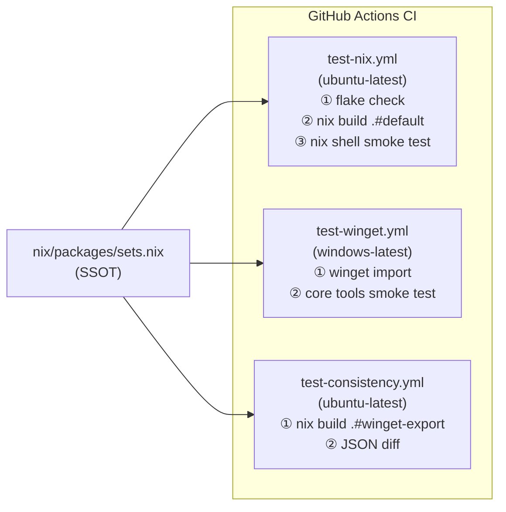

# クロスプラットフォーム環境検証 CI 設計

## 目的

Nix（WSL/NixOS）と Windows（winget）で **同じ CLI ツールが実際に動く** ことを CI で自動検証する。
「JSON が整合している」だけでなく、「バイナリが存在して `--version` が返る」レベルを保証する。

## 背景・調査

### 業界の実態

| プロジェクト                | アプローチ                            | 何を保証するか        |
| --------------------------- | ------------------------------------- | --------------------- |
| 大多数の個人 NixOS dotfiles | `nix flake check` のみ                | Nix 式の評価可能性    |
| eza, nix-community/nh       | `nix build .#checks.*`                | 実コンパイル + テスト |
| home-manager 本体           | `home-manager switch` → uninstall     | 実際のユーザー体験    |
| starship                    | インストール後に `starship --version` | バイナリ動作確認      |

winget CI は個人 dotfiles では前例がほぼない。`windows-latest` runner では winget が標準で利用可能（Windows Server 2025）。

### 設計決定

**Approach A+B の組み合わせ:**

- **Nix 側（B）**: `nix build` 実ビルド + `nix shell` でクロスプラットフォームツール全検証
- **Windows 側（A）**: winget import + core ツールの `--version` スモークテスト
- **既存の整合性チェック**: `test-consistency.yml` は変更なし

Approach C（全量 winget + 全ツール検証）は winget Store API への依存による flakiness リスクを避けるため見送り。

## アーキテクチャ

## ワークフロー仕様

### test-nix.yml（拡張）

**トリガー**: `nix/**`, `flake.nix`, `flake.lock`

| ステップ           | 変更前      | 変更後                                               |
| ------------------ | ----------- | ---------------------------------------------------- |
| Build package sets | `--dry-run` | 実ビルド                                             |
| Smoke test         | なし        | **追加**: `nix shell .#default` で core ツール全検証 |

**検証ツール**: chezmoi, git, gh, fd, rg, bat, jq, eza, zoxide, fzf

### test-winget.yml（新規）

**トリガー**: `windows/winget/packages.json`, `nix/packages/sets.nix`

1. winget ブートストラップ（runner に未搭載の場合のみ）
2. `winget import windows/winget/packages.json --ignore-unavailable --no-upgrade`
3. core ツールの `--version` 確認

**検証ツール（winget ID あり）**: chezmoi, git, gh, fd, rg, jq, eza, zoxide, fzf
（bat/unzip/p7zip は winget ID なしのため対象外）

### test-consistency.yml（変更なし）

JSON 整合性チェックのみ。

## トレードオフ

| 項目                   | 判断                                       |
| ---------------------- | ------------------------------------------ |
| winget 全量 import     | ✅ 採用（packages.json のシナリオテスト）  |
| Windows で全ツール検証 | ❌ core のみ（Store API flakiness を限定） |
| home-manager switch    | ❌ 過剰（tool 本体の CI ではないため）     |
| Cachix                 | ❌ 未設定（nixpkgs binary cache で十分）   |

## 検証対象外（意図的）

- bat, unzip, p7zip: winget ID なし → Windows インストール検証不可
- Windows-only パッケージ（VS Code 等）: GUI インストーラーが CI 非対応
- WSL 内での nixos-rebuild switch: runner がネスト仮想化非対応
